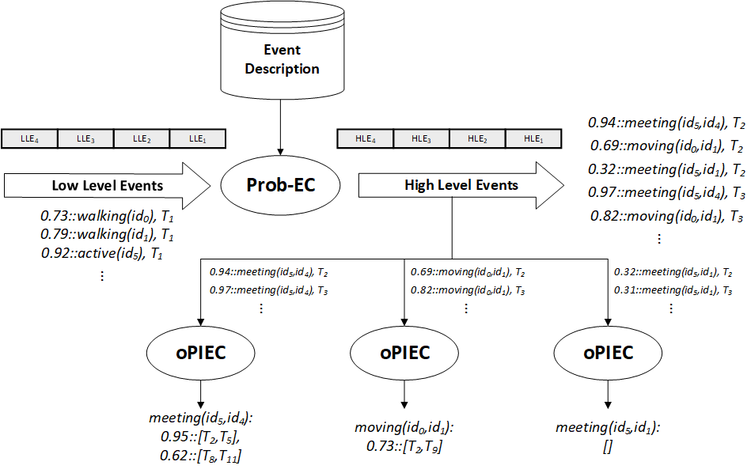

## Probabilistic Complex Event Recognition

Complex Event Recognition (CER) systems process streams of ‘low-level’ or ‘simple' events, derived from sensor data, and infer 'high-level' or 'composite' activities by means of pattern matching. These patterns combine simple and composite event occurrences with spatio-temporal constraints. Uncertainty is inherent in many CER applications. An input stream may contain low-level events expressed as Pr::LLE, where Pr corresponds to the probability value of the low-level event, serving as its confidence estimate. A probabilistic event recognition system consumes such streams and derives a collection of complex events with attached probability values. 

Prob-EC performs probabilistic CER by computing the probability of every complex event at each time-point. Prob-EC extends the Event Calculus, a logic formalism for representing and reasoning about events and their effects, with the ability to handle uncertainty in the input stream using the probabilistic reasoning modules of ProbLog 2. As an example, see the flow chart of the system, where Prob-EC and oPIEC are employed in the case of human activity recognition. Prob-EC, equipped with the event description of the domain, processes a probabilistic stream of simple events, e.g. \`walking', and computes the complex events, like \`meeting' -- a relational event between multiple agents, that occur at each time-point, along with the probability of their occurrence. 

<figure class="image">
    
</figure>

The output of Prob-EC is a stream of complex event - probability pairs for various activities. oPIEC may process a stream of event probabilities and compute maximal temporal intervals during which the event takes place. As seen in the flow diagram, the stream of high level events is separated into multiple complex event probability streams which are, subsequently, fed into a different instance of oPIEC. Each instance processes an input stream in data batches, while potential starting points of intervals are stored in a small, auxiliary memory which is managed by oPIEC. Additionally, a probabilistic threshold is used to exclude intervals with a low probability value. As an example, the last instance of oPIEC in the diagram does not compute any interval for the event as a result of low event probabilities in the input.

Prob-EC and oPIEC may work as two separate systems. However, we use a pipeline of Prob-EC and oPIEC because it has been observed that oPIEC alleviates the uncertainty in the output of Prob-EC, leading to more robust recognition. This approach has been tested on human activity recognition and maritime monitoring applications.  

### Available Applications

- Human Activity Recognition ([CAVIAR dataset](http://groups.inf.ed.ac.uk/vision/CAVIAR/CAVIARDATA1/)).
- Maritime Monitoring ([Brest dataset](https://zenodo.org/record/1167595)).

For download instructions, a brief description of the datasets and usage instructions, you may refer to the '.txt' files in the /datasets folder.

### Requirements

- A version of [Python 3](https://docs.python.org/3/) with [pip](https://pip.pypa.io/en/stable/installing/) and [setuptools](https://pypi.org/project/setuptools/).

The rest of the required Python packages are installed via setuptools (see the Instructions section). These packages include [ProbLog 2](https://dtai.cs.kuleuven.be/problog/) and the [intervaltree](https://pypi.org/project/intervaltree/) package.

Please consider installing these packages in a [virtual environment](https://docs.python.org/3/tutorial/venv.html) to avoid messing up the (versions of the) packages installed in the Python version installed in your system. The process of setting up a virtual environment is explained in the Instructions section. 

### Instructions: Installation and Execution 

To download oPIEC, open a terminal and follow these steps:

1. ``` git clone https://github.com/Periklismant/oPIEC ``` in the folder of your preference. 

2. ``` cd oPIEC ```

Afterwards, you may set up and activate a virtual environment for installing the required Python packages as follows:

3. ``` virtualenv venv ``` creates a virtual environment named "venv".

4. ``` . venv/bin/activate ``` activates "venv". You may check the Python version used by venv with ``` python --version ```. Also, the output of ``` pip freeze ```, which prints the list of installed python packages, should be an empty list.

5. ``` pip install . ``` installs the python packages specified in the setup.py file.

Apart from installing the packages needed for oPIEC, the final command installs a command line interface for oPIEC. 

6. For example, you may use the interface of oPIEC as follows: 

- ``` oPIEC ``` or ``` oPIEC --help ``` prints the usage instructions for oPIEC.

- ``` oPIEC --use-case maritime --dataset ./datasets/examples/maritime_short_test run-pipeline ```, when executed from the root folder of the repository, runs a pipeline of Prob-EC and oPIEC using the maritime data available in the /datasets/examples/maritime_short_test folder.

- ``` oPIEC --use-case caviar --dataset ./datasets/examples/caviar_test run-pipeline ```, when executed from the root folder of the repository, runs a pipeline of Prob-EC and oPIEC using the human activity data available in the /datasets/examples/caviar_test folder.

7. After you finish experimenting, do not forget to ``` deactivate ``` the virtual environment.

### Execution Details

The following steps describe the execution of the 'run-pipeline' command of the command line interface of oPIEC. There are two other available commands, 'run-probec' and 'run-opiec', which separately execute Prob-EC and oPIEC, respectively. 'run-pipeline' does the following:

- Firstly, Prob-EC processes the input of 'low-level' events and the event description of the application (e.g. /src/Prob-EC/maritime/event_description). The output of Prob-EC is saved in the /Prob-EC_output/raw folder. 

- Afterwards, an auxiliary script transforms the output of Prob-EC by isolating the probabilities computed for each event. As a result, the recognition of Prob-EC for each complex event is stored in the /Prob-EC_output/preprocessed folder. This format is compatible with oPIEC. 

- Finally, oPIEC is executed for each of the generated files. The final output, produced by oPIEC, is stored in the /oPIEC_output folder and denotes the maximal intervals during which the event takes place.

To run custom experiments, you may adjust he parameters of each script (at the top of the file) to change, e.g., the input file of simple events. You may refer to the comments in the script files for more usage instructions. 

### License

This program comes with ABSOLUTELY NO WARRANTY. This is free software, and you are welcome to redistribute it under certain conditions; See the [GNU Lesser General Public License v3 for more details](https://www.gnu.org/licenses/lgpl-3.0.html).

### Documentation

- Mantenoglou P., Artikis A., Paliouras G. [Online Probabilistic Interval-based Event Calculus](https://doi.org/10.3233/FAIA200399). 24th European Conference on Artificial Intelligence (ECAI), Santiago de Compostela, Spain, pp.2624-2631, 2020.
- Skarlatidis A., Artikis A., Filipou J., Paliouras G. [A probabilistic logic programming event calculus](https://doi.org/10.1017/S1471068413000690). Theory and Practice of Logic Programming (TPLP), 15(2):213-245, 2015.
